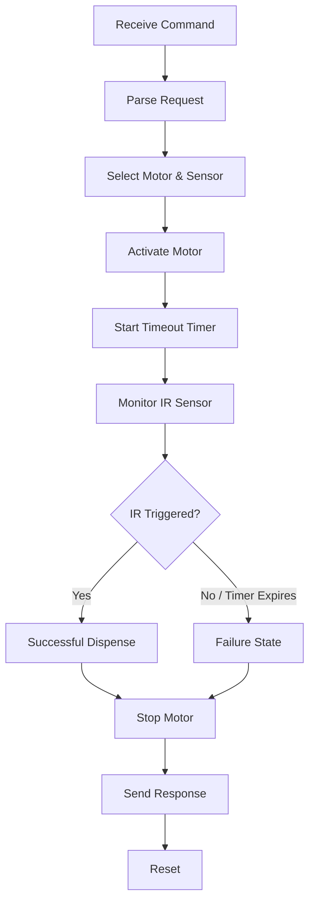

# SwagOverflow – Portable Prize Dispensing Machine

## Introduction

SwagOverflow is a portable, compact vending machine developed as a senior design project at the University of Texas at Arlington. The system combines an interactive game with an automated dispensing mechanism that awards prizes to players.

This repository contains the **embedded hardware and controller software** developed for the dispensing system. The controller is responsible for receiving commands from the Android application, controlling the dispensing motors, monitoring infrared sensors, and reporting the result of each dispensing operation.

The overall system consists of an Android tablet running the game and management interface, a data layer for communication and storage, and an STM32-based controller responsible for the physical dispensing mechanism.

## My Implementation

My primary contributions focused on the **embedded controller and hardware communication**, including:

* Developed embedded C firmware for the **STM32F446RE** microcontroller.
* Implemented USB communication between the STM32 controller and Android tablet using the **Android Open Accessory (AOA) protocol**.
* Implemented **Protocol Buffers (protobuf)** messaging for structured USB communication.
* Developed SPI communication between the STM32 and an **MCP23S17 SPI GPIO expander**.
* Designed and implemented the control logic for dispensing motors and infrared sensors.
* Implemented a **finite state machine (FSM)** to manage the dispensing process.
* Used interrupts to detect successful prize dispensing through infrared sensors.
* Implemented timer-based failure detection to stop motors when a prize is not dispensed within the timeout period.
* Contributed to the design of the PCB used for the motor and infrared sensor circuitry.

The controller receives a dispensing command from the Android application, determines which motor and infrared sensor correspond to the requested prize, and executes the dispensing sequence. The STM32 communicates with the GPIO expander over SPI to control the motors and monitor the infrared detection circuitry.

### System Architecture

The high-level system is divided into three layers:


The complete system architecture separates the user-facing application, data/communication functionality, and real-time hardware controller.

## Hardware

### Main Components

* **STM32F446RE / NUCLEO-F446RE**

  * Main embedded controller
  * Handles USB communication and dispensing logic
  * Runs low-level C firmware

* **MCP23S17 SPI GPIO Expander**

  * Expands the available GPIO
  * Controls dispensing motors
  * Interfaces with infrared detection circuitry

* **Infrared LEDs**

  * Generate the infrared beam used for item detection

* **Infrared Transistors**

  * Detect interruptions in the infrared beam
  * Used to determine whether an item has successfully passed through the dispensing mechanism

* **DC Motors**

  * Drive the individual dispensing mechanisms

The STM32 communicates with the GPIO expander through SPI and uses the additional GPIO to control motors and monitor infrared sensors.

## Software

### Embedded Controller

The controller software is written primarily in **C** and runs directly on the STM32 without a dedicated operating system. The firmware uses a combination of polling, interrupts, SPI communication, USB communication, and hardware timers.

### USB Communication

The STM32 acts as the USB Host for communication with the Android tablet. The communication uses the **Android Open Accessory (AOA) v1 protocol**.

Messages exchanged between the tablet and controller use **Protocol Buffers**, allowing structured commands and responses to be transmitted over USB.

Incoming requests contain information such as:

```text
Command
Target
Parameters
```

The controller processes the request and returns a response indicating whether the operation succeeded or failed.

The embedded implementation uses **nanopb**, a lightweight C implementation of Protocol Buffers designed for embedded systems.

### SPI Communication

The STM32 operates as the SPI master and communicates with the MCP23S17 GPIO expander.

The SPI communication is used to:

1. Select the GPIO expander.
2. Send the appropriate read/write opcode.
3. Specify the target register.
4. Write output data or read input data.
5. Release chip select after the transaction.

This allows the controller to control the dispensing motors and monitor the infrared sensor inputs.

## Dispensing Logic

The dispensing mechanism is controlled using a finite state machine.

The general process is:



When a dispensing command is received, the controller activates the appropriate motor and starts a timeout timer. The infrared sensor is monitored using an interrupt-driven input. When an item interrupts the infrared beam, the controller interprets the event as a successful dispense and stops the motor.

If the timer expires before the infrared sensor is triggered, the controller enters a failure state and disables the motor to prevent unnecessary mechanical operation. The system then resets its state before accepting another dispensing operation.

## PCB

A custom PCB was developed for the dispensing hardware. The board interfaces the controller with the motor drivers and infrared detection circuitry.

The hardware includes circuitry for:

* Dispensing motors
* Infrared LEDs
* Infrared transistors
* Controller/GPIO connections
* SPI communication

The design documentation includes the circuit board used for the dispensing system and a dedicated circuit for the motors and infrared detection components.

## Technologies

**Languages**

* C
* Protocol Buffers

**Microcontroller**

* STM32F446RE

**Communication**

* USB
* Android Open Accessory (AOA)
* SPI

**Hardware**

* MCP23S17 SPI GPIO Expander
* DC Motors
* Infrared LEDs
* Infrared Transistors
* Custom PCB

**Embedded Concepts**

* Finite State Machines
* Hardware Timers
* Interrupts
* GPIO
* SPI
* USB Host Communication

## Repository Scope

This repository contains the **embedded controller and hardware communication code** for the dispensing system.

The Android/Unity game application is **not included** in this repository. The USB communication interface and Protocol Buffer messaging used to communicate between the game application and STM32 controller are included.

## Project Documentation

The complete system design documentation describes the architecture, controller logic, USB communication, SPI interface, PCB, and Protocol Buffer message structure.
